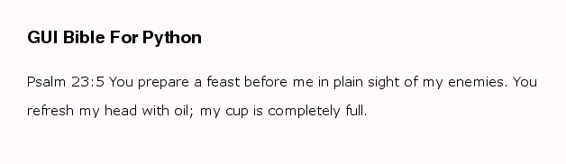

.. eventsim documentation master file, created by
   sphinx-quickstart on Sun Jul  5 21:39:27 2015.
   You can adapt this file completely to your liking, but it should at least
   contain the root `toctree` directive.

.. title:: Net

NET
===

**net** is a *guibible* module and has a class called ``Bible``. 

Bible
------

Bible has two methods namely:

* display() --> Displays a specified bible verse in a graphical format.
* read() --> Displays a specified bible verse in the console window.
  

Arguments
^^^^^^^^^

the **Bible** class can take between **0 - 4** arguments. It tries to help fix spelling errors and wrong book name, chapter or verse and if none can be fixed, it falls back to the nearest correct mistake level. For example, if psalm was spelt wrongly, it falls back to Genesis, if Psalm has no chapter 2345, it falls back to Psalm 1.

Zero argument
"""""""""""""
``Bible()`` -- > Will get the default values i.e. Genesis Chapter 1.

___________________________________________________

One argument
"""""""""""""
**Bible("Book name")**

``Bible("Exodus")`` -- > Will use first parameter as the book name and a default chapter 1 to get the verse i.e. Exodus Chapter 1.

___________________________________________________

Two argument
"""""""""""""
**Bible("Book name", chapter number)**

``Bible("Psalm", 3)`` -- > Will use first parameter as the book name and the second parameter as the second parameter as the chapter number to get the passage i.e. Psalm 3.

___________________________________________________

Three argument
"""""""""""""""
**Bible("Book name", chapter number, verse begin number)**

``Bible("Psalm", 23, 5)`` -- > Will use first parameter as the book name, the second parameter as the chapter, and the third parameter as the verse number to get the passage i.e. Psalm 23:5.

___________________________________________________

Four argument
"""""""""""""""
**Bible("Book name", chapter number, verse begin number, verse end number)**

``Bible("Proverb", 2, 4, 6)`` -- > Will use first parameter as the book name, the second parameter as the chapter, and the third parameter as the verse starting number and the fourth parameter as the verse end-number to get the passage i.e. Proverb 2:4-6. 

___________________________________________________

Importing module class
^^^^^^^^^^^^^^^^^^^^^^

You can import the Bible class in any of the following ways. For example:

.. sidebar:: Usage

	.. code:: python

	  var = guibible.net.Bible("Genesis")      #1

	  var = Bible("Psalm", 1)     #2

	  var = somename.Bible("Exodus", 1, 4) 	#3

	  var = somename.Bible("1 Thessalonians", 3, 4, 5)     #4

.. code:: python

    import guibible.net 	#1

.. code:: python

    from guibible.net import Bible 	#2

.. code:: python

    import guibible.net as somename 	#3

.. code:: python

    from guibible.net import Bible as somename 	#4

___________________________________________________

Module methods
^^^^^^^^^^^^^^
read()
""""""
Read takes no argument and can be used easily after importing the Bible class and creating an instance as in the example below. It will then print the corresponding passage to the console window.

.. code-block:: python
   
   from guibible.net import Bible
   sample = Bible("Psalm", 23)
   sample.read()

.. image:: ./_static/console.png
  :alt: Console result

___________________________________________________

display()
"""""""""
display can be used easily after importing the Bible class and creating an instance as in the example below. It will then display the corresponding passage in a window using pygame's graphic display. It takes between zero to two arguments.

Arguments
~~~~~~~~~~

.. sidebar:: note
    
    A tuple or list is required to change foreground and background colour for the display argument. 

    e.g. display( **(0, 255, 0)**, **(255, 0, 0)** )

**Zero arguments**

`instance_variable`.display()

uses the default foreground and background colours

___________________________________________________

**One argument**

**Display( [R, G, B] )**

`instance_variable`.display( (**foreground colour**) ) 

will set the text foreground color to the specifed *RGB* tuple or list and leave the background as the default value. e.g. the code below will set the texts colour to blue.

.. code:: python

	sample.bible( (0,0,255) )

___________________________________________________

**Two arguments**

`instance_variable`.display( [**foreground colour**], [**background colour**] ) 

will set the text foreground color to the first *RGB* tuple or list argument and the background color to the second *RGB* tuple or list argument. e.g. the code below will set the texts colour to white and the background colour to black.

.. code:: python

	sample.bible( [255, 255, 255], [0, 0, 0] )

.. image:: ./_static/psalm23_dark.png
   :alt: light on dark

___________________________________________________

.. important::

   pygame must be installed for this to work

   To install **pygame**, simply go to the shell (terminal) and type:

   .. code:: python

     pip install pygame

Example
~~~~~~~~
.. code-block:: python
   
   from guibible.net import Bible
   sample = Bible("Psalm", 23)
   sample.display()

Result
~~~~~~~

Quitting the GUI display window
^^^^^^^^^^^^^^^^^^^^^^^^^^^^^^^^
.. note:: **Quitting**

	To quit the gui window, press the ``Q``, ``ESC (escape)`` or the ``SPACE bar`` key on the keyboard.
